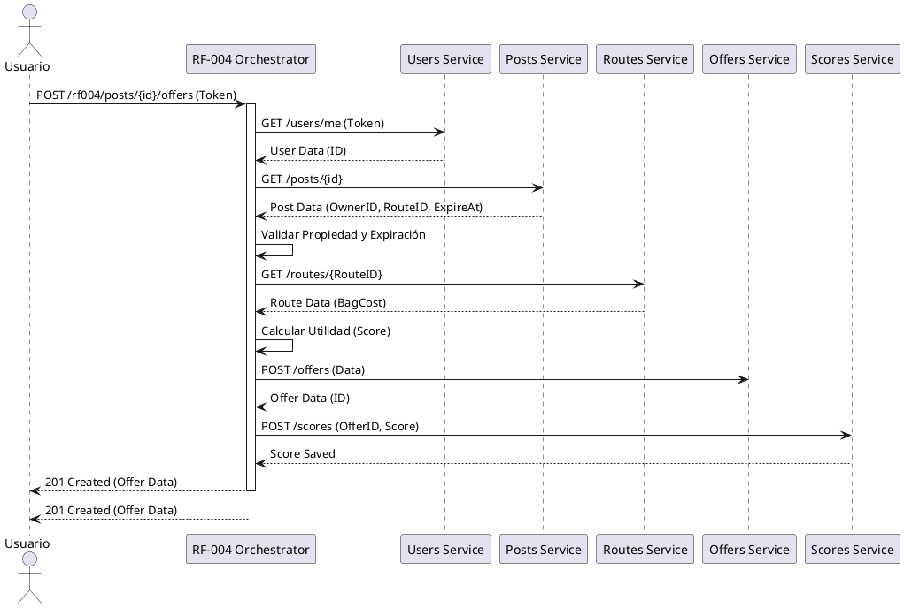

# Requerimiento RF-004: Crear Ofertas

Este requerimiento permite a un usuario realizar una oferta sobre una publicación existente. La solución implementa un patrón de **Orquestador** (Saga Basada en Orquestación simplificada) para coordinar las llamadas entre diversos microservicios.

## Patrón Utilizado

| Requerimiento | Patrón utilizado | Justificación | Atributos de calidad favorecidos | Atributos de calidad desfavorecidos | Componentes involucrados |
| :--- | :--- | :--- | :--- | :--- | :--- |
| RF-004 | Orquestador / Agregador | Permite centralizar la lógica de coordinación y cálculo de utilidad sin acoplar los servicios base. | Escalabilidad, Separación de responsabilidades | Disponibilidad (depende de múltiples servicios) | rf004-app, users-app, posts-app, routes-app, offers-app, scores-app |

## Componentes Nuevos

| Componente | Código/Id | Tipo | Responsabilidad | Integraciones |
| :--- | :--- | :--- | :--- | :--- |
| Scores App | `scores-app` | Microservicio | Almacenar la utilidad (score) calculada para cada oferta. | `rf004-app` (REST), `scores-db` (PostgreSQL) |
| RF-004 Orchestrator | `rf004-app` | Microservicio | Coordinar el flujo de creación de ofertas: validar usuario, validar post, calcular utilidad, crear oferta y guardar score. | `users-app`, `posts-app`, `routes-app`, `offers-app`, `scores-app` (REST) |

## Proceso de Solución (Paso a Paso)

1. **Autenticación**: El usuario envía su token en el header `Authorization`. `rf004-app` valida el token con `users-app`.
2. **Validación de Publicación**: Se consulta `posts-app` para verificar que la publicación existe, no ha expirado y no pertenece al mismo usuario.
3. **Cálculo de Utilidad**:
    - Se obtiene el `bagCost` del trayecto asociado a través de `routes-app`.
    - Se aplica la fórmula: `utilidad = monto_oferta - (ocupacion * costo_maleta)`.
    - Porcentajes de ocupación: LARGE (100%), MEDIUM (50%), SMALL (25%).
4. **Persistencia**:
    - Se crea la oferta en `offers-app`.
    - Se guarda el resultado de la utilidad en `scores-app`.
5. **Respuesta**: Se retorna el ID de la oferta creada y un mensaje de éxito.

## Diagramas (PlantUML)

### Modelo de Secuencia



## Guía de Despliegue

Para desplegar estos cambios en EKS, siga estos pasos:

### 1. Preparar Imágenes
Construya y suba las imágenes al repositorio ECR (asegúrese de estar autenticado):

```bash
# Login ECR
aws ecr get-login-password --region us-east-1 | docker login --username AWS --password-stdin 095473173548.dkr.ecr.us-east-1.amazonaws.com

# RF-004 App
docker build -t 095473173548.dkr.ecr.us-east-1.amazonaws.com/rf004-service:v1.0.0 ./rf004_app
docker push 095473173548.dkr.ecr.us-east-1.amazonaws.com/rf004-service:v1.0.0

# Scores App
docker build -t 095473173548.dkr.ecr.us-east-1.amazonaws.com/scores-app:v1.0.0 ./scores_app
docker push 095473173548.dkr.ecr.us-east-1.amazonaws.com/scores-app:v1.0.0
```

### 2. Despliegue en K8s
Aplique los manifiestos (asegúrese de que los archivos `*-db-*` hayan sido eliminados si usa RDS):

```bash
kubectl apply -f k8s/
```
