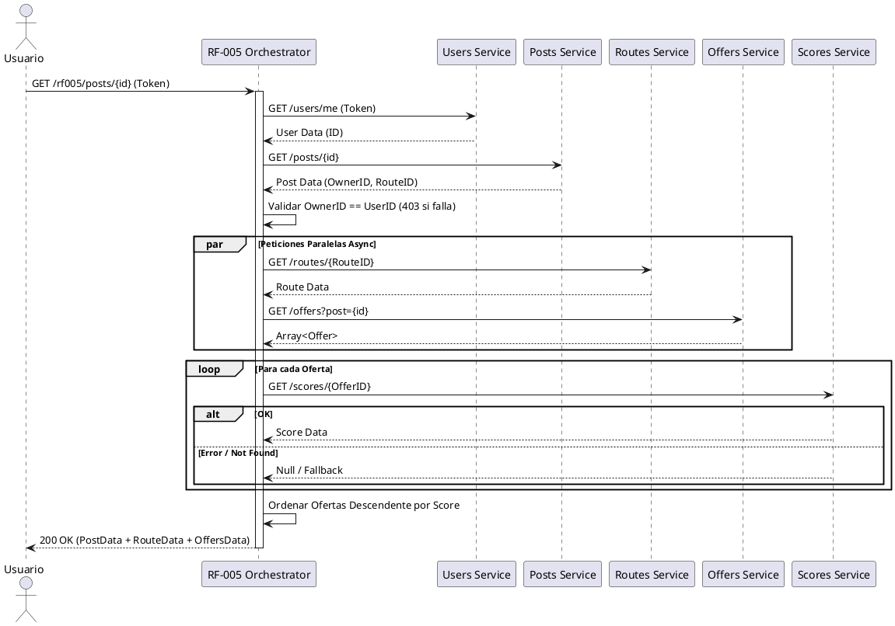

# Requerimiento RF-005: Consultar Ofertas de una Publicación

Este requerimiento permite a un usuario consultar su publicación junto con la información detallada del trayecto asociado y todas las ofertas realizadas, ordenadas de forma descendente por la utilidad calculada.

La solución implementa un patrón de **Orquestador / Agregador** para coordinar las peticiones a varios microservicios y ensamblar una única respuesta, garantizando así un solo punto de acceso para el cliente frontend/móvil.

## Patrón Utilizado

| Requerimiento | Patrón utilizado | Justificación | Atributos de calidad favorecidos | Atributos de calidad desfavorecidos | Componentes involucrados |
| :--- | :--- | :--- | :--- | :--- | :--- |
| RF-005 | Orquestador / Agregador | Permite centralizar la lógica de negocio responsable de unir los datos, validar permisos de visualización y ordenar ofertas, sin alterar el diseño de los microservicios core. | Escalabilidad, Separación de responsabilidades | Disponibilidad (depende de múltiples servicios simultáneamente) | rf005-app, users-app, posts-app, routes-app, offers-app, scores-app |

## Componentes Nuevos

| Componente | Código/Id | Tipo | Responsabilidad | Integraciones |
| :--- | :--- | :--- | :--- | :--- |
| RF-005 Orchestrator | `rf005-app` | Microservicio | Recibir la petición del cliente, verificar identidad, y agregar datos de posts, routes, offers y scores en una única estructura JSON unificada y ordenada. | `users-app`, `posts-app`, `routes-app`, `offers-app`, `scores-app` (REST) |

## Proceso de Solución (Paso a Paso)

1. **Autenticación**: El usuario envía su token JWT en el header `Authorization`. El servicio `rf005-app` valida el token mediante `users-app`.
2. **Validación de Publicación**: `rf005-app` consulta `posts-app` para obtener la publicación original y valida que el propietario de la publicación coincida con el ID del usuario extraído del token. En caso contrario, se deniega el acceso (`403 Forbidden`).
3. **Obtención de Metadatos**: El orquestador obtiene los detalles del vuelo y equipaje desde `routes-app` a partir del `routeId`.
4. **Obtención de Ofertas y Utilidades**:
    - Se consultan todas las ofertas de dicha publicación desde `offers-app`.
    - Por cada oferta obtenida, de forma paralela asíncrona, se consulta su utilidad (`score`) en `scores-app`.
    - **Resiliencia**: Si el servicio de utilidades no responde o lanza error temporal (404/503), se captura el error y se asigna el valor `null` a la utilidad, para evitar degradar la consulta general.
5. **Ensamblado y Ordenación**:
    - Las ofertas enriquecidas con el `score` se ordenan de forma descendente de manera que el usuario vea la más rentable primero. (Los valores `null` se consideran infimos/falsos para que queden al final de lista).
6. **Respuesta**: Se retorna el objeto completo en un JSON unificado (código HTTP `200 OK`).

## Diagramas (PlantUML)

### Modelo de Secuencia



## Guía de Despliegue

La solución está completamente contenedorizada y lista para su despliegue en el cluster Kubernetes activo (EKS).

### 1. Preparar Imágenes
Construya y suba la imagen al repositorio ECR:

```bash
# Login ECR
aws ecr get-login-password --region us-east-1 | docker login --username AWS --password-stdin AWS_ACCOUNT_ID.dkr.ecr.us-east-1.amazonaws.com

# RF-005 App
docker build -t AWS_ACCOUNT_ID.dkr.ecr.us-east-1.amazonaws.com/rf005-service:v1.0.0 ./rf005_app
docker push AWS_ACCOUNT_ID.dkr.ecr.us-east-1.amazonaws.com/rf005-service:v1.0.0
```

### 2. Despliegue en K8s
Aplique los manifiestos en el namespace por defecto (default):

```bash
kubectl apply -f k8s/rf005-deployment.yaml
kubectl apply -f k8s/rf005-service.yaml
```
