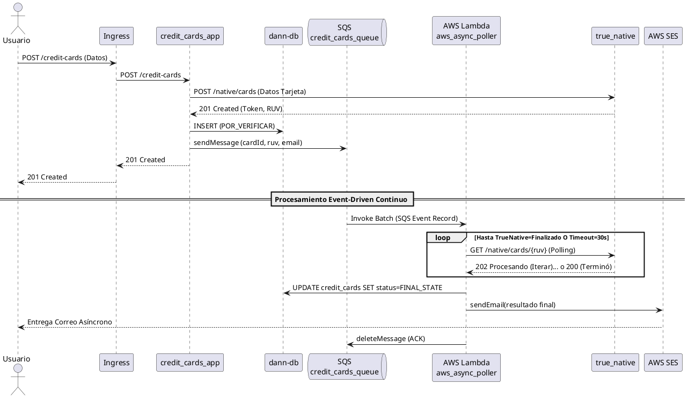

# RF-006: Gestión de Tarjetas de Crédito

Como usuario deseo almacenar mis tarjetas de crédito en la plataforma para poder realizar pagos de servicios si lo requiero.

## Patrón de Solución: Arquitectura Dirigida por Eventos (Polling Asíncrono)

Para cumplir con la restricción de poseer un único punto de acceso sincrónico y una latencia baja, pero lidiar con el servicio simulado (`true_native`) que toma hasta 30 segundos en procesar verificaciones bancarias, decidimos implementar una Arquitectura Orientada a Eventos (EDA) apoyada de un Worker Serverless.

| Requerimiento | RF-006 |
|---|---|
| **Patrón utilizado** | Event-Driven Architecture (API Sincrónica + Cola + Worker Poller Asíncrono) |
| **Justificación** | El proceso de validación del tercero es demorado (polling iterativo requerido por hasta 30 segundos). Bloquear los hilos HTTP del API REST reduciría drásticamente la disponibilidad de la plataforma y violaría explícitamente la restricción de "no usar multithreading directo". Delegar esto a una Cola de Mensajes (AWS SQS) y ejecutar el polling de fondo en AWS Lambda permite el retorno de una respuesta HTTP veloz (201 Created con tarjeta en `POR_VERIFICAR`). |
| **Atributos de calidad favorecidos** | **Escalabilidad** (la cola SQS absorbe picos masivos de demanda sin ahogar el cluster Kubernetes principal), **Disponibilidad** (la API nunca se bloquea en tiempos de espera IO), **Tolerancia a Fallos** (si Lambda cae, el mensaje vuelve a intentar en SQS). |
| **Atributos de calidad desfavorecidos** | **Complejidad** (aumenta carga cognitiva de desarrollo y tracing debido a Lambda+SQS+SES), **Consistencia Múltiple** (pasamos a consistencia eventual, el usuario ve el estado real minutos después en lugar de inmediato). |
| **Componentes involucrados** | `credit_cards_app`, `credit_cards_queue`, `aws_async_poller`, `true_native`. |

## Proceso Paso a Paso (Secuencia)

1. El cliente hace una petición HTTP `POST /credit-cards` a través del **Ingress** con los datos sensibles de su tarjeta.
2. `credit_cards_app` procesa sincrónicamente validaciones básicas y realiza un único llamado rápido al API de un tercero `true_native` (`POST /native/cards`) para asegurar y obtener el `RUV` criptográfico inicial.
3. El microservicio encripta datos, trunca el número, y guarda la tarjeta en la BD (RDS Postgres) con estado temporal `POR_VERIFICAR`.
4. El microservicio publica un mensaje eventPayload a la mensajería `credit_cards_queue` (AWS SQS) dictando que se generó una validación pendiente, y finaliza la petición HTTP devolviendo código `201 Created`. *(Fin de la experiencia sincrónica impuesta en los CR)*.
5. El sistema gestionado de SQS asíncronamente triggerea a la función `aws_async_poller` (Lambda Serverless) mediante batch streams.
6. La Lambda recibe el `RUV`. Inicia un bucle interno estricto de **Polling**, consultando `GET /native/cards/{ruv}` repetitivamente con pausa entre intentos, durante máximo 30 segundos.
7. Una vez `true_native` retorna veredicto definitivo (`APROBADA` o `RECHAZADA`), la función sale del bucle, se conecta por TCP local VPC a la base de datos `dann-db` y realiza el UPDATE de la tarjeta con el estado final y el Date.now actual.
8. La Lambda invoca inmediatamente a Amazon Simple Email Service (`AWS SES`) y ordena despachar un correo detallado al usuario informándole la resolución del proceso. Finaliza el evento indicándole a SQS borrar el mensaje exitosamente.

### Diagrama de Secuencia y Patrones

