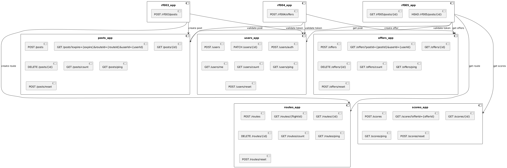

# Vista de Desarrollo

Esta sección describe los estándares técnicos y procesos de colaboración del equipo.

## Branching Strategy
Utilizamos **GitHub Flow**:
- `main`: Rama protegida que contiene código estable y listo para despliegue.
- `feat/`, `fix/`, `docs/`, `chore/`: Ramas para desarrollo de funcionalidades, correcciones o documentación.
- Todos los cambios se integran mediante **Pull Requests** hacia `main`.

## Code Review Requirements
- Al menos **1 aprobación** de un par antes de integrar a `main`.
- Superar todos los checks de los pipelines de CI (Documentation, Unit Tests, K8s).
- Comentarios constructivos y resolución de hilos de discusión.

## Commit Message Conventions
Seguimos el estándar de **Conventional Commits**:
- `feat`: Nueva funcionalidad.
- `fix`: Corrección de errores.
- `docs`: Cambios en la documentación.
- `chore`: Tareas de mantenimiento o configuración.
- `ci`: Cambios en archivos de configuración de pipelines.
- `refactor`: Cambios en el código que no corrigen errores ni añaden funcionalidades.

## Definition of Done (DoD)
Una tarea se considera finalizada cuando:
1. El código cumple con las guías de estilo (Linting).
2. Se han implementado pruebas unitarias con una cobertura >= 70%.
3. La documentación técnica ha sido actualizada (`/docs`).
4. Los manifiestos de Kubernetes han sido actualizados (`/k8s`).
5. El Pull Request ha sido aprobado y mergeado.

## Descripción de nuevos componentes

Para la Entrega 2, se han incorporado los siguientes componentes core y de orquestación:

- **scores_app**: Microservicio encargado de la persistencia y consulta de calificaciones de ofertas.
- **rf003_app**: Orquestador para el proceso de creación de publicaciones, validando tokens con `users_app` y creando rutas con `routes_app`.
- **rf004_app**: Orquestador para el proceso de creación de ofertas, validando tokens con `users_app` y publicaciones con `posts_app`.
- **rf005_app**: Orquestador para la consulta detallada de publicaciones, consolidando información de `users`, `posts`, `offers`, `routes` y `scores`.

Para la Entrega 3, se han incorporado los siguientes componentes serverless y de integración:

- **user-events-sns**: Bus de eventos (SNS) que desacopla la creación de usuarios y tarjetas de su verificación y notificación.
- **verification-trigger-lambda**: Función serverless que reacciona a la creación de usuarios y solicita la verificación a TrueNative.
- **notification-service-lambda**: Función serverless que reacciona a la finalización de la verificación y envía correos mediante **Gmail SMTP**.
- **truenative**: Plataforma externa (simulada en K8s) para verificación de datos y gestión de pagos.
- **credit-cards-app**: Microservicio para la gestión de tarjetas de crédito (implementado asíncronamente).

