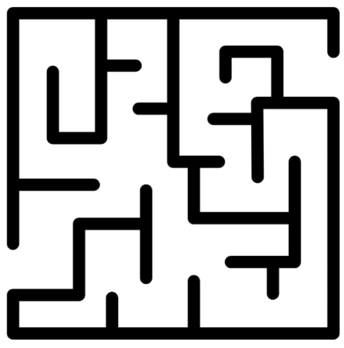
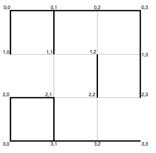

# Proyecto: Agente de Aprendizaje por Refuerzo para Resolución de Laberintos

Para el proyecto del curso desarrollaremos un agente de aprendizaje por refuerzo para la resolución de laberintos, como se muestra en la figura.

## Descripción del Problema

El propósito del agente es, desde la posición de partida del laberinto (a la izquierda en la imagen), alcanzar la posición de salida del laberinto (a la derecha de la imagen). El agente podrá moverse dentro del tablero en las cuatro direcciones cardinales: arriba, abajo, izquierda y derecha, y no puede sobrepasar las paredes del laberinto.

El objetivo del agente es poder resolver cualquier laberinto, pero nos concentraremos en un laberinto específico. Los laberintos están representados por cuadrículas de tamaño **n × m** (8×7 en el caso específico a resolver) con paredes previamente definidas.

## Formato del Archivo de Definición del Laberinto

Para entrenar el agente recibirá un laberinto específico que debe cargar para el agente. El archivo de definición del laberinto es un archivo de texto definido de la siguiente forma:

- **Primera línea**: Dos números **n** y **m** (separados por un espacio) representando respectivamente la cantidad de filas y columnas del laberinto.

- **Segunda línea**: Un único número **k** describiendo la cantidad de paredes que existen en el laberinto.

- **Siguientes k líneas**: Describen cada uno de los segmentos de pared del laberinto en el tablero. Cada línea contiene 4 números delimitando el segmento de recta en el que se encuentra la pared: **x1, y1, x2, y2** (el punto de inicio y fin del segmento de pared, contados desde la esquina superior izquierda de cada casilla).

### Ejemplo de Definición de Laberinto 3×3

A continuación se muestra un ejemplo de la definición de un tablero de 3×3. La figura muestra el ejemplo del laberinto construido:

#### ------------------------------------------------------------------------------------------------------------
3 3

3 3

14

0 0 0 1

0 1 0 2

0 2 0 3

0 1 1 1

0 0 1 0

0 3 1 3

1 3 2 3

2 0 3 0

3 0 3 1

3 1 3 2

3 2 3 3

2 0 2 1

2 1 3 1

1 2 2 2

# -------------------------------------------------------------------------------------------------------------------

## Objetivos y Evaluación

El primer objetivo del agente es poder salir del laberinto. Sin embargo, para el proyecto, el agente (entrenado) se considerará efectivo si sale del laberinto en el **menor número de pasos posible**.

Dentro del proyecto evaluaremos el agente con un laberinto estándar sobre el cual se debe entrenar y ejecutar el agente. Sin embargo, tendremos un reto adicional ejecutando el agente en múltiples otros laberintos. 

**Se dará un bono adicional a los agentes que puedan resolver diversos laberintos.**